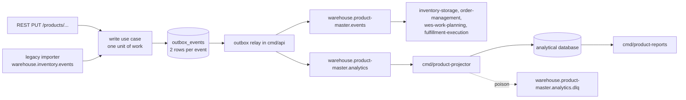

# Operations runbook

How `product-master` is deployed and operated: what runs, what it reads and
writes, how it starts and stops, and the routine procedures. Every value below
comes from `charts/product-master`, the four `cmd/*/main.go` files and the
adapters they wire. For every environment variable see
[Configuration](/docs/operations/configuration); for failure modes see
[Troubleshooting](/docs/operations/troubleshooting).

## What gets deployed

One Helm chart, `product-master` (`charts/product-master`, chart and app
version `0.1.0` in `Chart.yaml`), and one container image built by the root
`Dockerfile` that holds every binary under `/app/` (`api` is the entrypoint;
the other Deployments set `command`). The console remote has its own image
(`web/Dockerfile`, nginx-unprivileged).

| Deployment (component label) | Enabled by | Command | Container port | Service | Probes (path, port) |
| --- | --- | --- | --- | --- | --- |
| `<fullname>` (`api`) | always | `/app/api` | `http` 8080 | `<fullname>`, port 80 to `http` | startup `/healthz` (every 2s, 30 failures), liveness `/healthz`, readiness `/readyz` |
| `<fullname>-mcp` (`mcp`) | `mcp.enabled` | `/app/mcp` | `http` 8090 | `<fullname>-mcp`, port 8090 to `http` | startup, liveness and readiness all `/healthz` |
| `<fullname>-projector` (`analytics-projector`) | `analytics.enabled` | `/app/product-projector` | `admin` 8091 | none | startup and liveness `/healthz`, readiness `/readyz` |
| `<fullname>-reports` (`analytics-reports`) | `analytics.enabled` | `/app/product-reports` | `http` 8092 | `<fullname>-reports`, port 80 to `http` | startup, liveness and readiness all `/healthz` |
| `<fullname>-frontend` (`frontend`) | `frontend.enabled` | nginx (image `warehouse/product-master-frontend`) | `http` 8080 | port 80 to 8080 | liveness and readiness `/healthz` |

`<fullname>` is the release name when it already contains `product-master`,
otherwise `<release>-product-master` (`product-master.fullname` in
`templates/_helpers.tpl`).

In the kind cluster (warehouse-infra) the fullname is `product-master`, so the
Services are `product-master`, `product-master-mcp` and
`product-master-reports` in the `warehouse-systems` namespace. REST goes
through Kong at `http://localhost:8000/api/product-master` (prefix stripped),
the remote through the Nginx web gateway at
`http://localhost/mfes/product-master/`. MCP and the reports API are
in-cluster only.

The chart refuses to render when no database is configured
(`product-master.requireDatabase`), when `config.eventPublisher=kafka` or a
legacy import group is set without `kafka.enabled`
(`requireKafkaForPublisher`, `requireKafkaForLegacyImport`), and when
`analytics.enabled` lacks Kafka or a DSN source (`requireAnalyticsConfig`).
`charts/product-master/tests/test_service_selectors.py` checks that every
Service selects exactly one Deployment.

The REST and MCP surfaces have no authentication: access control is the
cluster boundary (ClusterIP Services, Kong at the edge).

## Data stores

| Store | Used by | Tables | Migrations |
| --- | --- | --- | --- |
| OLTP Postgres (`DATABASE_URL`) | `cmd/api` (read-write), `cmd/mcp` (reads only) | `products`, `outbox_events`, `processed_events` | `internal/adapters/outbound/postgres/migrations/0001_products_outbox.up.sql`, embedded |
| Analytical Postgres (`ANALYTICS_DATABASE_URL`, `product_master_analytics` in the kind cluster) | `cmd/product-projector` (only writer), `cmd/product-reports` (read-only pool) | `analytics_processed_events`, `product_facts`, `profile_states` | `analytics/migrations/0001_master_data_quality.up.sql`, embedded |

- `products`: one row per Product aggregate, SKU in the `C` collation (byte
  order, which the list cursor relies on), `version` guarding every update.
- `outbox_events`: the transactional outbox, unique on `(event_id, topic)`;
  `published_at`, `attempts` and `last_error` record the relay's progress.
- `processed_events`: idempotency claims of the legacy importer, keyed by
  `(consumer, event_id)`.
- `analytics_processed_events`: one row per applied CloudEvents `id`;
  `max(occurred_at)` is the projection's freshness.
- `product_facts`: per SKU, the earliest registration, classification,
  declaration and measurement times and the current profile state.
- `profile_states`: the physical-profile history per `(sku, version)`, used to
  count discrepancies open at the end of each day.

The analytical database is a projection: it can be dropped and rebuilt from
the analytics topic (see [Rebuild the analytics read model](#rebuild-the-analytics-read-model)).

## Migrations

- `cmd/api` and `cmd/mcp` both apply the embedded OLTP migrations with
  golang-migrate **on every start**, before the HTTP listener opens. The step is
  idempotent and golang-migrate's advisory lock makes concurrent starts safe.
- `cmd/product-projector` applies the embedded analytical migrations on start.
  `cmd/product-reports` never migrates.
- The migration step uses `MIGRATIONS_DATABASE_URL` when set (a **direct**
  Postgres DSN), else `DATABASE_URL`. Use the direct DSN whenever
  `DATABASE_URL` goes through PgBouncer in transaction mode: the
  session-scoped advisory lock does not survive it. The projector has no such
  split, so `ANALYTICS_DATABASE_URL` itself must be direct.
- Migrations and the first ping run under `internal/bootretry`: 5 attempts with
  1s, 2s, 4s and 8s between them. On exhaustion the process exits with the last
  error and Kubernetes restarts it; the startup probe allows about 60s (2s x 30)
  before liveness takes over.
- There is no separate migration Job and no automatic down migration. The
  `.down.sql` files exist for manual rollback only.

## Event flow



Source: `cmd/api/main.go`, `internal/application/usecases/writer.go`,
`internal/adapters/outbound/kafka/analytics_encoder.go` (`FanoutEncoder`),
`internal/adapters/outbound/outbox/relay.go`,
`internal/adapters/inbound/kafka/analytics_consumer.go`,
`cmd/product-projector/main.go`, `cmd/product-reports/main.go`.

## Kafka topics and consumer groups

| Topic | Direction | Who | Consumer group | Key | Notes |
| --- | --- | --- | --- | --- | --- |
| `warehouse.product-master.events` | produced | outbox relay in `cmd/api` (`EVENT_PUBLISHER=kafka`) | n/a | SKU | Published Language: five `com.warehouse.wms.product-master.product.*` types, CloudEvents 1.0 structured mode. |
| `warehouse.product-master.analytics` | produced | outbox relay in `cmd/api` | n/a | SKU | Same five events, same CloudEvents `id`, dataschema `urn:warehouse:product-master:analytics:<EventName>:v1`. |
| `warehouse.product-master.analytics` | consumed | `cmd/product-projector` | `ANALYTICS_CONSUMER_GROUP` (default `product-master-analytics`) | | At-least-once; offsets committed only after the event is applied or dead-lettered. |
| `warehouse.product-master.analytics.dlq` | produced | `cmd/product-projector` | n/a | original key | Poison messages, raw and unmodified, plus `x-dlq-*` headers. |
| `warehouse.inventory.events` | consumed | legacy importer in `cmd/api` | `LEGACY_IMPORT_CONSUMER_GROUP` (warehouse-infra uses `product-master-legacy-import`) | | Migration only (ADR 0003); acts on `com.warehouse.wms.inventory-storage.product.ProductClassified` only. |

Every writer uses `RequireAll` acks, the `Hash` balancer on the key (one
SKU's events stay in order on one partition), a 10 ms batch timeout and
automatic topic creation. Readers use `FetchMessage` then `CommitMessages`
(never auto-commit). The fleet has one Kafka broker (in-cluster; `localhost:9092`
from the host).

## Outbox relay

- Runs inside `cmd/api` only (never in `cmd/mcp`). Every write use case inserts
  the encoded events into `outbox_events` in the **same** transaction as the
  product row; the `FanoutEncoder` writes two rows per event (integration and
  analytics topic) with one shared CloudEvents `id`.
- Each pass claims up to 100 unpublished rows in `id` order with
  `FOR UPDATE SKIP LOCKED` (so several API replicas never claim the same row),
  sends them one at a time, and marks each one `published_at = now()`. A full
  batch triggers the next pass at once; otherwise it sleeps
  `OUTBOX_RELAY_INTERVAL` (default 1s).
- On the first send failure the pass stops, increments `attempts`, stores
  `last_error` on that row and commits what was already sent, so a later event
  of a SKU never overtakes an earlier one. The failed row is retried on the
  next pass, forever: there is no attempt limit and no dead-letter for the
  outbox.
- Delivery is at-least-once with a stable `id`: consumers deduplicate on it.
- With `EVENT_PUBLISHER=log` (the default) rows are logged and marked
  published, so nothing accumulates but nothing reaches Kafka either.

Check the backlog:

```sql
SELECT topic, count(*) AS pending, max(attempts) AS max_attempts, min(created_at) AS oldest
FROM outbox_events WHERE published_at IS NULL GROUP BY topic;

SELECT id, event_type, subject, attempts, last_error
FROM outbox_events WHERE last_error IS NOT NULL AND published_at IS NULL ORDER BY id LIMIT 20;
```

## Consumers and dead letters

| Consumer | Deterministic failure | Transient failure | DLQ |
| --- | --- | --- | --- |
| Projector (`AnalyticsConsumer`) | Not a CloudEvent: skipped, rate-limited WARN (one per minute with a suppressed count). Unknown type: ignored. Known type with an unusable payload, or a store rejection (SQLSTATE class 22 or 23): dead-lettered, then committed past. | Same message retried with backoff 200 ms doubling to 5 s, offset not committed; never dead-lettered. | `warehouse.product-master.analytics.dlq` |
| Legacy importer (`LegacyImporter`) | Not a CloudEvent, other type, malformed payload or invalid classification: WARN and committed past. | Same message retried with the same backoff until it succeeds or the process stops. | none |

Dead-lettered messages carry the original key, value and headers plus
`x-dlq-source-topic`, `x-dlq-source-partition`, `x-dlq-source-offset`,
`x-dlq-error` and `x-dlq-failed-at`. If the DLQ write itself fails the message
is retried (a poison message is never dropped); a freshly auto-created DLQ
topic without a leader is retried up to 40 times, 250 ms apart.

## Readiness and shutdown

- `cmd/api` opens its listener only after migrations and the Postgres ping
  succeeded, so `/healthz` answering means the adapters are wired. `/readyz`
  returns `200 {"status":"ready"}` from then on and does **not** re-check
  Postgres or Kafka; it flips to `503 {"status":"not_ready"}` only as the first
  step of shutdown.
- `cmd/api` shutdown order on SIGTERM: flip `/readyz`, wait
  `SHUTDOWN_DRAIN_DELAY` (5s), drain HTTP (10s), stop and await the legacy
  importer (10s), stop and await the relay last (10s), close the pool. The
  chart's `terminationGracePeriodSeconds` is 40.
- `cmd/product-projector` serves `/readyz` on its admin port, flips it first
  on SIGTERM, drains the admin server, then lets the consumer finish the
  message in flight (bounded by 10s). If the consumer loop stops on its own,
  the process exits non-zero so the pod restarts.
- `cmd/mcp` and `cmd/product-reports` have no `/readyz`: their probes all use
  `/healthz`, and they drain HTTP for up to 10s on SIGTERM.

## Reports API

`cmd/product-reports` serves two read-only routes over the analytical
database (both are also in `apis/openapi.yaml` under the `Reports` tag):

| Route | Query | Response |
| --- | --- | --- |
| `GET /reports/master-data-quality` | `from`, `to`: RFC 3339, optional. No bounds: the 30 days ending now. Only `to`: the 30 days ending at `to`. Only `from`: from `from` to now. The range is half-open, at most 366 days, `from` before `to`; otherwise `400` with problem type `invalid-report-range`. | `{"from","to","days":[{"day","registered","classified","dimensions_declared","measured","open_discrepancies"}],"coverage":{"products","classified","dimensions_declared","measured","open_discrepancies","classified_ratio","dimensions_declared_ratio","measured_ratio","discrepancy_ratio"}}`. One row per UTC day, zeros included. Day counts are SKUs whose **first** such event fell in that day; `open_discrepancies` is the state at the end of the day. Ratios are over `products`, except `discrepancy_ratio` which is over `measured`. |
| `GET /reports/freshness` | none | `{"as_of": <time of the newest applied event>, "lag_seconds": <now - as_of>}`, both `null` until the first event is applied; a clock behind the event reads as 0. |
| `GET /healthz` | none | `{"status":"ok"}` |

A failing analytical query returns `500` with problem type
`report-store-error`; the SQL error is logged, never returned. In the kind
cluster the Kong route for `/api/product-master/reports/*` does not reach this
service (see the known issue on [Bounded context](/docs/overview/context));
use `kubectl -n warehouse-systems port-forward svc/product-master-reports 8092:80`.

## Scaling

- `cmd/api`: `autoscaling.api` (disabled by default; min 1, max 4, 70% CPU)
  renders an HPA and drops `replicas` from the Deployment. Several replicas are
  safe: the relay claims rows with `SKIP LOCKED`, product writes are
  version-guarded (`409 concurrent-modification` for the loser) and the legacy
  importer shares one consumer group and deduplicates on the event id. The
  chart notes it has not been load-tested.
- `cmd/mcp`: deliberately **not** scalable past one replica. The MCP SDK keeps
  per-process session state and the Service has no session affinity.
- `cmd/product-projector`: one replica is enough; more replicas share the
  partitions of one group and every write is idempotent.
- `cmd/product-reports`: stateless, scale freely.
- Connection budget per pod: `cmd/api` 10 and `cmd/mcp` 10 on the OLTP
  database (`postgres.MaxConns`), projector 5 and reports 5 on the analytical
  database. Size Postgres `max_connections` (or PgBouncer) for
  `10 x (api replicas + mcp replicas)`.
- Statement timeouts: 5s (OLTP), 10s (projector), 15s (reports).

## Housekeeping

There is **no** sweeper or retention job in this repo:

- published `outbox_events` rows stay forever (`published_at` set);
- `processed_events` and `analytics_processed_events` grow with every
  consumed event;
- `profile_states` keeps every profile version.

If you prune, delete only published outbox rows
(`DELETE FROM outbox_events WHERE published_at < now() - interval '30 days'`).
Do not prune `processed_events` or `analytics_processed_events` while the
corresponding messages can still be redelivered from Kafka: they are the
idempotency guard.

## Routine procedures

### Re-publish an event

The relay sends every row with `published_at IS NULL`, using the bytes and the
CloudEvents `id` stored at encode time. To re-send one event to one topic:

```sql
UPDATE outbox_events SET published_at = NULL WHERE event_id = '<id>' AND topic = 'warehouse.product-master.events';
```

Consumers that deduplicate on the `id` (all of the fleet's) treat it as a
duplicate; use it to repair a consumer that lost data, not to change data.

### Rebuild the analytics read model

The projector is idempotent per event id, so a replay into the same tables
changes nothing. To rebuild from scratch:

1. Scale the projector to 0.
2. Drop and recreate the analytical database (or truncate
   `analytics_processed_events`, `product_facts` and `profile_states`).
3. Set `analytics.projector.consumerGroup` to a new id: a new group starts at
   the earliest retained offset of `warehouse.product-master.analytics`.
4. Scale the projector back to 1 and watch `GET /reports/freshness` until
   `lag_seconds` is small.

The rebuild only covers what the topic still retains (topics are auto-created
with the broker's default retention).

### Re-drive the DLQ

There is no re-drive tool in this repo. Read the `x-dlq-error` header of each
message on `warehouse.product-master.analytics.dlq`, fix the cause (a payload
that does not match `apis/asyncapi.yaml`, or an analytical schema problem), then
produce the original value back to `warehouse.product-master.analytics` with
the same key. The event id makes a second application harmless.

### Start or stop the legacy importer

Set or clear `config.legacyImportConsumerGroup`. Unset, the importer is not
started; set, it resumes from the group's committed offsets. Keep the id
stable.

### Rotate database credentials

Update the Secret named by `database.existingSecret` (keys `DATABASE_URL` and
optionally `MIGRATIONS_DATABASE_URL`) or `analytics.database.existingSecret`
(`ANALYTICS_DATABASE_URL`, `ANALYTICS_READER_DATABASE_URL`), then restart the
Deployments (`kubectl rollout restart`). The `checksum/config` annotation only
tracks the api ConfigMap, so a Secret change does not roll the pods by itself.
