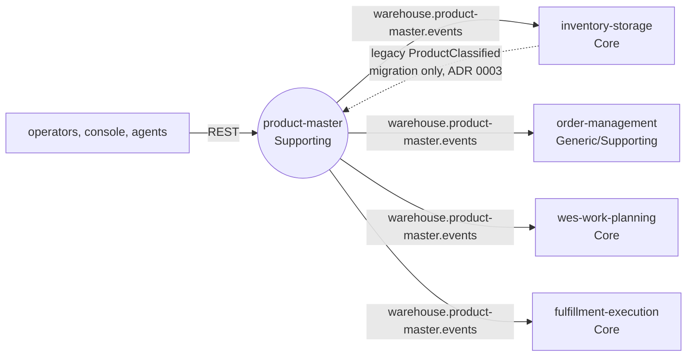

# Bounded context

## Purpose

`product-master` owns SKU-level product master data for the warehouse: what a
SKU *is* for handling purposes (its classification) and physically (its unit
dimensions and weight). Master-data stewards register SKUs, classify them and
declare their dimensions; dimensioning devices (or people with a tape and a
scale) record measurements. Every accepted change is published once, as a
CloudEvent, so the contexts that act on these facts keep their own copy.

Before this context existed, the only product facts in the fleet lived inside
`inventory-storage` (its ADRs 0009 and 0010), next to the stock ledger, and
three services read them live over REST. [ADR 0001](/docs/adr/0001-product-master-bounded-context)
moves ownership here because "what a SKU is" and "how many of it sit where"
change for different reasons, at different rates, by different people.

## Context map

Source: `docs/adr/0001-product-master-bounded-context.md` (Context map),
`docs/adr/0003-migration-from-inventory-storage.md`,
`internal/adapters/inbound/kafka/legacy_importer.go`,
`internal/adapters/outbound/kafka/encoder.go`; on the consumer side each
sibling's `ProductClassified` consumer on `develop`.
Omits: the Kafka broker, Kong and the patterns on each edge (see the
[context map](/docs/ddd/context-map) for those).

The four downstream contexts each consume only
`com.warehouse.wms.product-master.product.ProductClassified` today; see
[Downstream consumers](/docs/ecosystem/downstream-consumers).

## No live cross-context lookup, in either direction

- `product-master` never calls a sibling context. It has no outbound HTTP
  client at all; the only outbound adapters are Postgres and the Kafka relay
  sink.
- Downstream contexts do not call `product-master` at request time either.
  They keep a local copy built from the published events (full state per
  concern, keyed and partitioned by SKU, guarded by `version`). The REST `GET`
  endpoints exist for operators, the console and agents, not for
  service-to-service reads (ADR 0001).

## Runtime surface

| Process | Role | Port |
| --- | --- | --- |
| `cmd/api` | REST API, the outbox relay, and (when `LEGACY_IMPORT_CONSUMER_GROUP` is set) the legacy classification importer | `:8080` (`HTTP_ADDR`) |

`cmd/api` wires Postgres when `DATABASE_URL` is set (running the embedded
migrations first) and in-memory adapters otherwise; the relay publishes to
Kafka with `EVENT_PUBLISHER=kafka` and only logs each message otherwise
(`cmd/api/main.go`). See [Runtime and integration mechanics](/docs/overview/runtime).
