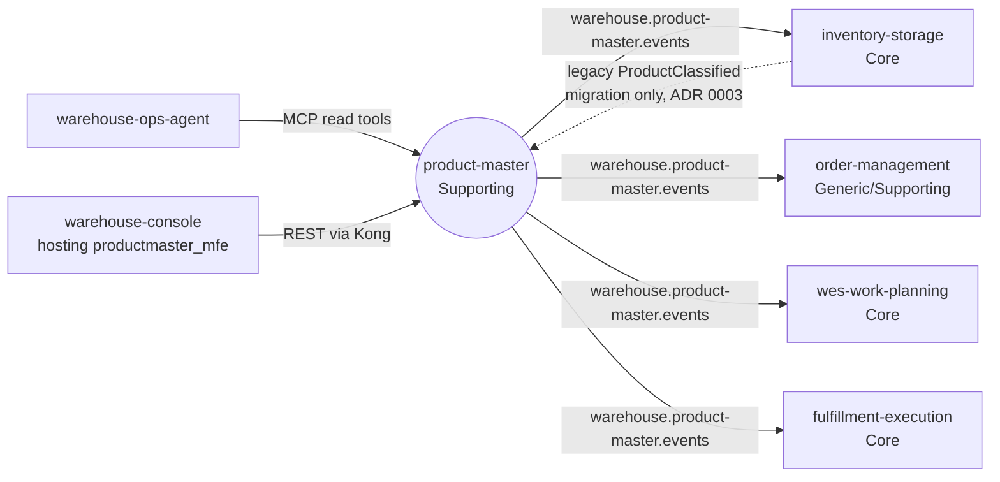

# Bounded context

## Purpose

`product-master` owns SKU-level product master data for the warehouse: what a
SKU *is* for handling purposes (its classification) and physically (its unit
dimensions and weight). Master-data stewards register SKUs, classify them and
declare their dimensions; dimensioning devices (or people with a tape and a
scale) record measurements. Every accepted change is published once, as a
CloudEvent, so the contexts that act on these facts keep their own copy.

Before this context existed, the only product facts in the fleet lived inside
`inventory-storage` (its ADRs 0009 and 0010), next to the stock ledger, and
three services read them live over REST. [ADR 0001](/docs/adr/0001-product-master-bounded-context)
moves ownership here because "what a SKU is" and "how many of it sit where"
change for different reasons, at different rates, by different people.

## Context map

Source: `docs/adr/0001-product-master-bounded-context.md` (Context map),
`docs/adr/0003-migration-from-inventory-storage.md`,
`internal/adapters/inbound/kafka/legacy_importer.go`,
`internal/adapters/outbound/kafka/encoder.go`; on the consumer side each
sibling's `ProductClassified` consumer on `develop`, warehouse-ops-agent ADR
0020 and warehouse-console #66.
Omits: the Kafka broker, Kong, operators calling REST directly and the
patterns on each edge (see the [context map](/docs/ddd/context-map) for
those).

The four downstream contexts each consume only
`com.warehouse.wms.product-master.product.ProductClassified` today; see
[Downstream consumers](/docs/ecosystem/downstream-consumers).

## No live cross-context lookup, in either direction

- `product-master` never calls a sibling context. It has no outbound HTTP
  client at all; the only outbound adapters are Postgres and the Kafka relay
  sink.
- Downstream contexts do not call `product-master` at request time either.
  They keep a local copy built from the published events (full state per
  concern, keyed and partitioned by SKU, guarded by `version`). The REST `GET`
  endpoints and the read-only MCP tools exist for operators, the console and
  agents, not for service-to-service reads (ADR 0001, ADR 0005).

## Runtime surface

All four binaries ship in one image (`Dockerfile`); the console remote ships
in its own image (`web/Dockerfile`).

| Process | Role | Port |
| --- | --- | --- |
| `cmd/api` | REST API, the outbox relay, and (when `LEGACY_IMPORT_CONSUMER_GROUP` is set) the legacy classification importer | `:8080` (`HTTP_ADDR`) |
| `cmd/mcp` | Read-only MCP server, Streamable HTTP at `/` and `/mcp`, four tools over the same database; no writes, no relay, no Kafka ([ADR 0005](/docs/adr/0005-mcp-server-adoption)) | `:8090` (`MCP_ADDR`) |
| `cmd/product-projector` | Consumes `warehouse.product-master.analytics` into the separate analytical database ([ADR 0006](/docs/adr/0006-analytics-read-side)) | admin `:8091` |
| `cmd/product-reports` | Read-only `GET /reports/master-data-quality` and `GET /reports/freshness` over the analytical database | `:8092` |
| `web/` (`productmaster_mfe`) | Module Federation remote mounted by the warehouse-console shell; calls the REST API | nginx; dev `:5191` |

`cmd/api` wires Postgres when `DATABASE_URL` is set (running the embedded
migrations first) and in-memory adapters otherwise; the relay publishes to
Kafka with `EVENT_PUBLISHER=kafka` and only logs each message otherwise
(`cmd/api/main.go`). See [Runtime and integration mechanics](/docs/overview/runtime).

### Deployed (kind cluster)

warehouse-infra deploys all of the above in the `warehouse-systems`
namespace: REST through Kong at `http://localhost:8000/api/product-master`,
the remote through the web gateway at `http://localhost/mfes/product-master/`,
the MCP server in-cluster at `product-master-mcp:8090/mcp` (read by
warehouse-ops-agent), and the projector and reports with the
`product_master_analytics` database.

:::caution Known issue: reports through Kong
warehouse-infra declares a Kong route `/api/product-master/reports/*` for
`product-reports`, but requests to it are answered by the `/api/product-master`
route (the OLTP API, which has no `/reports/*` path), so they return `404`.
The reports service works in-cluster (Service `product-master-reports`, port
80 to 8092); reach it with
`kubectl -n warehouse-systems port-forward svc/product-master-reports 8092:80`
until the route is fixed in warehouse-infra.
:::
