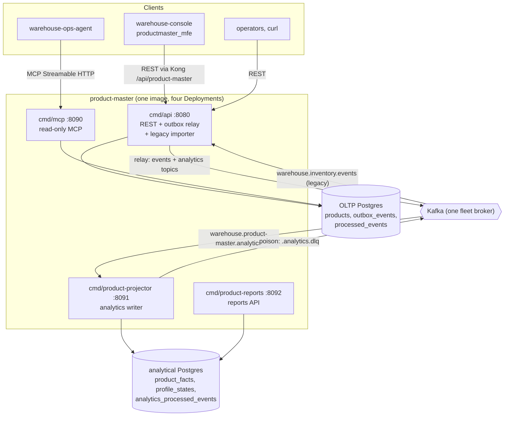

# Runtime and integration mechanics

## Layers

Hexagonal architecture, enforced by `TestHexagonalArchitecture` and the
fitness tests in `internal/architecture`:

| Layer | Path |
| --- | --- |
| Domain | `internal/domain/product` |
| Application (use cases, ports) | `internal/application/{usecases,ports,repository,outbox}`; analytics read model in `internal/analytics` |
| Inbound adapters | `internal/adapters/inbound/http` (REST and the reports router), `internal/adapters/inbound/kafka` (legacy importer, analytics consumer), `internal/adapters/inbound/mcp` (read-only MCP tools) |
| Outbound adapters | `internal/adapters/outbound/{postgres,memory,kafka,outbox,clock,telemetry,analyticsstore}` |
| CloudEvents helper | `internal/adapters/kafka/cloudevents` |
| Composition roots | `cmd/api/main.go`, `cmd/mcp/main.go`, `cmd/product-projector/main.go`, `cmd/product-reports/main.go` |

The domain imports nothing internal but itself; adapters never import each
other; only `cmd/*` wires them. The rest of this page describes `cmd/api`
after the overview of every binary; the MCP server is covered by
[MCP tools](/docs/mcp/tools) and [ADR 0005](/docs/adr/0005-mcp-server-adoption),
the analytics binaries by [ADR 0006](/docs/adr/0006-analytics-read-side) and the
[runbook](/docs/operations/runbook#reports-api).

## Binaries

All four are built into one image by the root `Dockerfile` (`/app/<name>`);
each is its own Deployment in `charts/product-master`.

| Binary | Role | Port | Reads | Writes |
| --- | --- | --- | --- | --- |
| `cmd/api` | REST API, outbox relay, legacy classification importer (ADR 0003, only when `LEGACY_IMPORT_CONSUMER_GROUP` is set) | `:8080` (`HTTP_ADDR`): REST, `/healthz`, `/readyz`, `/metrics` | OLTP Postgres; `warehouse.inventory.events` (importer) | OLTP Postgres; `warehouse.product-master.events` and `warehouse.product-master.analytics` (relay) |
| `cmd/mcp` | Read-only MCP server, four tools, Streamable HTTP at `/` and `/mcp` | `:8090` (`MCP_ADDR`) | OLTP Postgres | nothing (it runs the idempotent OLTP migrations at start) |
| `cmd/product-projector` | Analytics writer: projects the analytics topic into the analytical database | `:8091` (`ADMIN_ADDR`): `/healthz`, `/readyz` only | `warehouse.product-master.analytics` (group `ANALYTICS_CONSUMER_GROUP`) | analytical Postgres; `warehouse.product-master.analytics.dlq` |
| `cmd/product-reports` | Read-only reports API (`/reports/master-data-quality`, `/reports/freshness`) | `:8092` (`HTTP_ADDR`) | analytical Postgres (read-only pool) | nothing |

The console remote `productmaster_mfe` (`web/`) is a separate image that calls
the REST API. Every variable of every binary is on
[Configuration](/docs/operations/configuration).

## Container view

Source: `cmd/api/main.go`, `cmd/mcp/main.go`, `cmd/mcp/router.go`,
`cmd/product-projector/main.go`, `cmd/product-reports/main.go`,
`internal/adapters/outbound/kafka/encoder.go`,
`internal/adapters/outbound/kafka/analytics_encoder.go`,
`internal/adapters/inbound/kafka/legacy_importer.go`,
`internal/adapters/inbound/kafka/analytics_consumer.go`.
Omits: Kong and the Nginx web gateway, the OpenTelemetry Collector and the
four downstream contexts that consume `warehouse.product-master.events` (see
[Downstream consumers](/docs/ecosystem/downstream-consumers)).

## Data stores

| Store | Tables | Writers | Readers | Schema |
| --- | --- | --- | --- | --- |
| OLTP Postgres (`DATABASE_URL`) | `products`, `outbox_events`, `processed_events` | `cmd/api` | `cmd/api`, `cmd/mcp` | `internal/adapters/outbound/postgres/migrations` (embedded, applied by `cmd/api` and `cmd/mcp` at start) |
| Analytical Postgres (`ANALYTICS_DATABASE_URL`) | `analytics_processed_events`, `product_facts`, `profile_states` | `cmd/product-projector` | `cmd/product-reports` | `analytics/migrations` (embedded, applied by the projector at start) |

Without `DATABASE_URL`, `cmd/api` and `cmd/mcp` fall back to in-memory
adapters (separate per process). The analytical binaries have no in-memory
mode: `ANALYTICS_DATABASE_URL` is required.

## Writing: one unit of work per command

Every write use case (`internal/application/usecases/writer.go`) runs inside
one `ports.UnitOfWork`: load the `Product`, apply the aggregate command, save
it guarded by the loaded version, encode the raised events
(`EventEncoder`) and insert them into `outbox_events`. A command that raises
no event saves and enqueues nothing. With Postgres the unit of work is one
transaction (`internal/adapters/outbound/postgres/unit_of_work.go`); without
`DATABASE_URL` the in-memory adapters provide the same contract.

## Publishing: transactional outbox

- The encoder (`internal/adapters/outbound/kafka/encoder.go`) mints the
  CloudEvents `id` once, at encode time, and the row stores it, so a relay
  retry republishes the same id.
- The relay (`internal/adapters/outbound/outbox/relay.go`) drains every
  `OUTBOX_RELAY_INTERVAL` (default 1s); a full batch (100 rows) is followed
  immediately by another pass. `OutboxRepo.Drain` claims rows with
  `FOR UPDATE SKIP LOCKED`, sends them one at a time in id order, marks each
  published, and stops at the first failure (recording `attempts` and
  `last_error`) so a later event of a SKU never overtakes an earlier one.
- `EVENT_PUBLISHER=kafka` uses `RelaySink`: a topic-less kafka-go writer with
  `RequireAll` acks, a 10 ms batch timeout, the `Hash` balancer on the key (the
  SKU) and auto topic creation. The default `log` sink only logs each message.

## Consuming: the legacy importer (migration only)

- Started only when `LEGACY_IMPORT_CONSUMER_GROUP` is set (it then needs
  `KAFKA_BROKERS`); reads `warehouse.inventory.events`.
- `FetchMessage`, handle, then `CommitMessages`; never `ReadMessage`.
- Deterministic problems (not a CloudEvent, another type, malformed payload,
  invalid classification) are logged at WARN and committed past.
- A transient failure retries the **same** message with capped exponential
  backoff (200 ms doubling to 5 s) until it succeeds or the process stops;
  there is no dead-letter topic. A failed offset commit is retried the same
  way.
- `ImportLegacyClassification` claims the CloudEvents `id` in
  `processed_events` (consumer `legacy-classification-importer`) in the same
  unit of work as the registration, the import and the outbox insert.

## CloudEvents envelope

Structured content mode, Kafka header
`content-type: application/cloudevents+json; charset=UTF-8`,
`source=/warehouse/product-master`, `subject` = Kafka key = the SKU,
`dataschema=urn:warehouse:product-master:events:<EventName>:v1`
(`internal/adapters/kafka/cloudevents/cloudevents.go`, ADR 0004).

## Shutdown order

On SIGINT/SIGTERM `cmd/api`: (1) flips `/readyz` to `503`, (2) waits
`SHUTDOWN_DRAIN_DELAY` (default 5s), (3) drains HTTP (10s), (4) stops and
awaits the importer, (5) stops and awaits the relay last, then closes the
pool, so nothing committed is stranded.

## Observability

OTLP traces and metrics (`OTEL_EXPORTER_OTLP_ENDPOINT`), `otelchi` route spans
and request-duration metrics on every REST route, and `GET /metrics` with the
Go runtime and process collectors (`internal/adapters/outbound/telemetry`).
There is no business metric yet. Details, log fields and suggested alerts:
[Observability](/docs/operations/observability).
